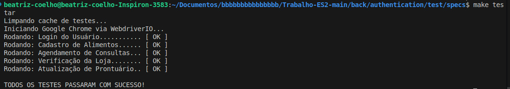
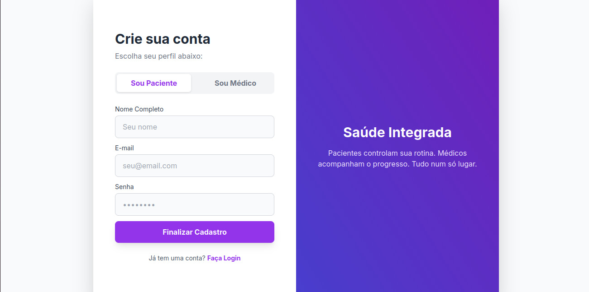
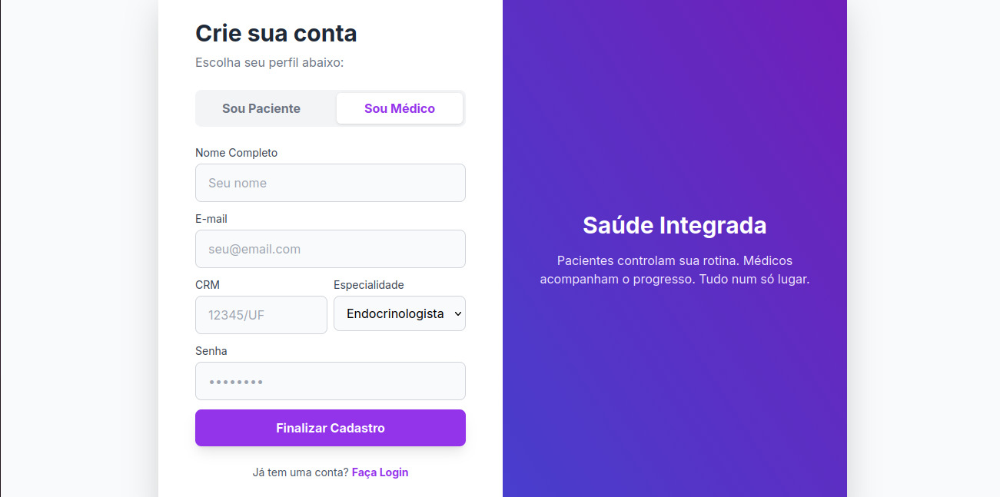
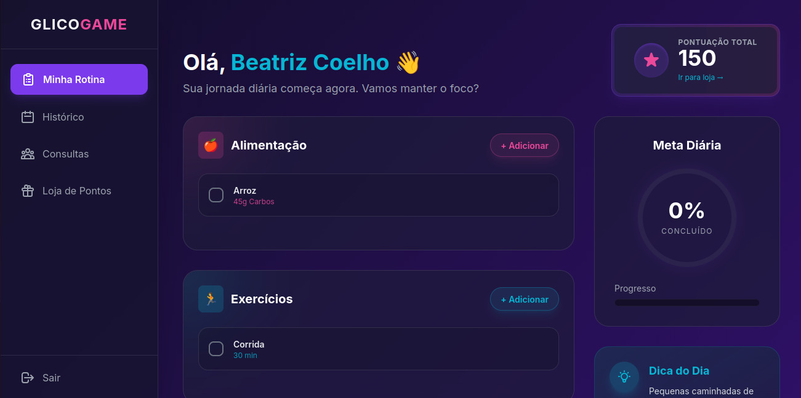
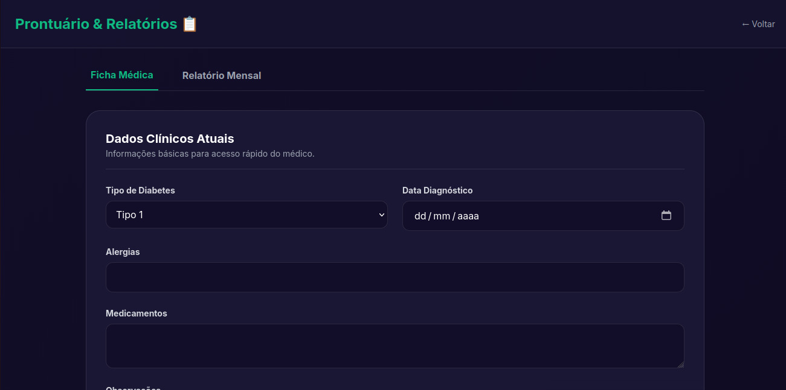
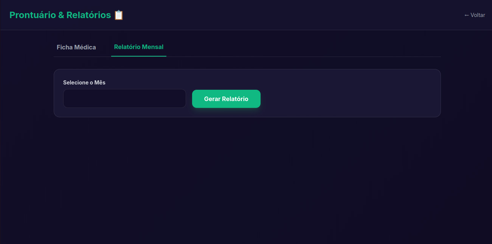
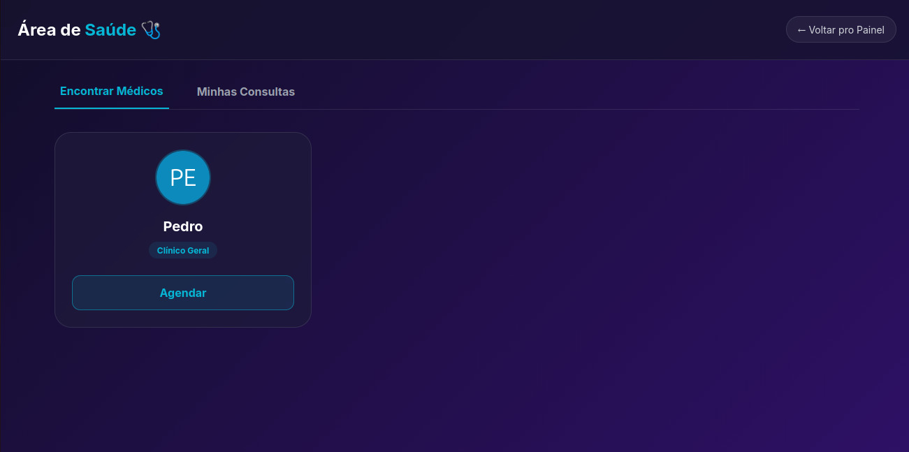
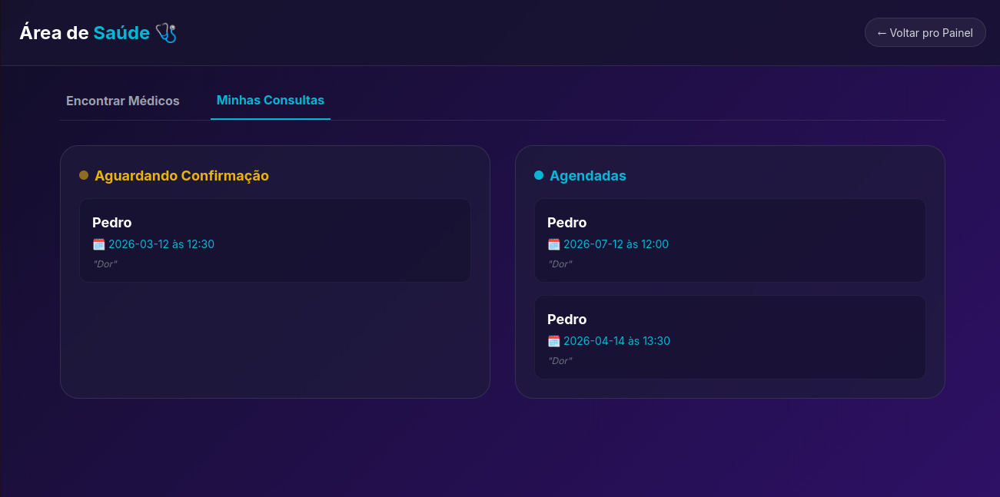
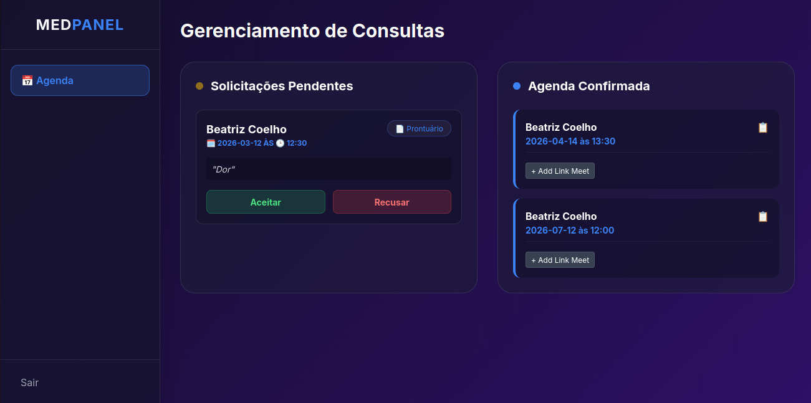

# Relatório de Testes Automatizados - GlicoGame

## 1. Introdução
Este documento apresenta os testes realizados para a validação do sistema **GlicoGame**, desenvolvido com foco no **ODS 3 (Saúde e Bem-Estar)**. Para garantir a qualidade do software, utilizei testes de interface (E2E) que simulam a jornada do usuário real dentro da plataforma.

## 2. Metodologia e Ferramentas
Como estudante, optei pelo framework **WebdriverIO** em conjunto com **Node.js** e **JavaScript**. Essa escolha foi feita por permitir uma automação rápida e integrada ao navegador Google Chrome.

* **Framework:** WebdriverIO v8+
* **Abordagem:** Testes de Interface / End-to-End (E2E)
* **Ambiente:** Localhost (Live Server)

## 3. Fluxos de Teste Executados

### Login (Autenticação)
- **O que testei:** O acesso seguro à plataforma.
- **Como foi feito:** O script insere o e-mail cadastrado (`b@gmail.com`) e a senha (`123`), clicando no botão de entrar.
- **Resultado esperado:** Redirecionamento bem-sucedido para o Dashboard.

### Registro de Rotina Alimentar e Exercícios
- **O que testei:** A funcionalidade principal de monitoramento diário no Dashboard.
- **Como foi feito:** Automatizei a abertura dos modais de "Alimentação" e "Exercícios", cadastrando "Arroz" e "Corrida".
- **Resultado esperado:** Os novos dados devem aparecer renderizados nas listas da tela sem precisar atualizar a página manualmente.

### Agendamento de Consultas
- **O que testei:** O fluxo de marcação de compromissos médicos.
- **Como foi feito:** Preenchimento de campos de data, hora e notas ("Dor") na página de médicos.
- **Resultado esperado:** O agendamento deve ser listado corretamente na aba "Minhas Consultas".

### Navegação na Loja de Pontos
- **O que testei:** A integração entre o sistema de pontos e a loja de recompensas.
- **Como foi feito:** Clique no link de pontos do Dashboard e teste do botão "← Voltar".
- **Resultado esperado:** Navegação fluida de ida e volta sem perda de sessão.

### Preenchimento de Prontuário (Histórico)
- **O que testei:** O armazenamento de informações clínicas fixas.
- **Como foi feito:** Seleção do tipo de diabetes ("Pré-diabetes") e preenchimento de campos de medicamentos e alergias.
- **Resultado esperado:** Confirmação de que os dados foram salvos no perfil do usuário.

## 4. Evidência de Execução
Todos os testes foram rodados via terminal e apresentaram **100% de sucesso (Pass)**.

### Print dos Testes no Terminal

## 5. Conclusão
Os testes automatizados confirmaram que as funções estão funcionando perfeitamente. Os IDs dos elementos HTML responderam corretamente e o sistema de rotas entre as páginas está estável, garantindo que o usuário consiga gerenciar sua saúde no GlicoGame de forma confiável.

## 6. Demonstração da Interface (Screenshots)

### 6.1 Acesso ao Sistema
**Tela de Login**

**Cadastro de Paciente**

**Cadastro de Médico**

---

### 6.2 Área do Paciente (Gamificação e Controle)
**Painel Principal (Dashboard)**

**Atualização de Prontuário**

**Histórico de Saúde**

---

### 6.3 Consultas e Recompensas
**Agendamento de Consulta**

**Minhas Consultas (Visão do Paciente)**

**Loja de Recompensas**

---

### 6.4 Visão do Profissional
**Painel do Médico (Consultas Disponíveis)**

---

## 2. Verificação e Validação (Testes Automatizados)

### 🚀 Evidência de Execução (Terminal)

